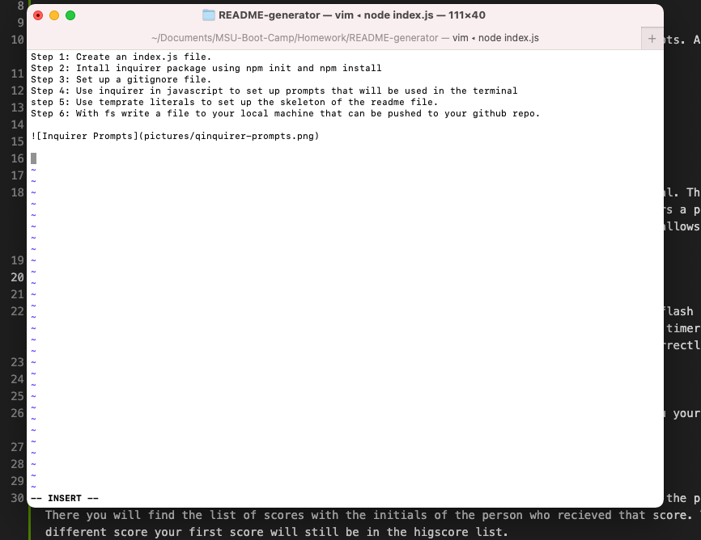
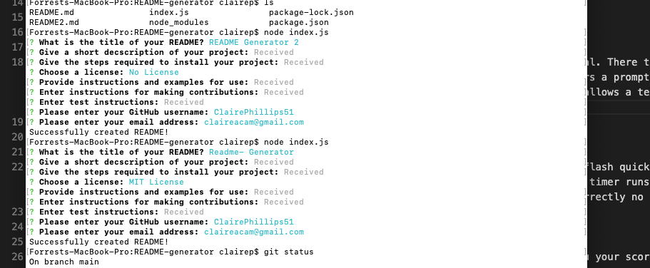
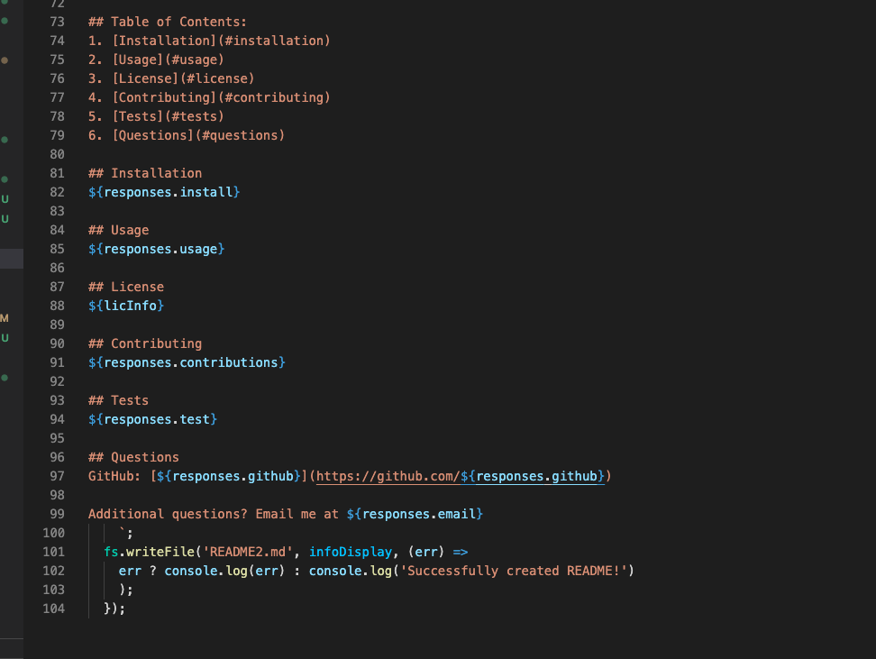
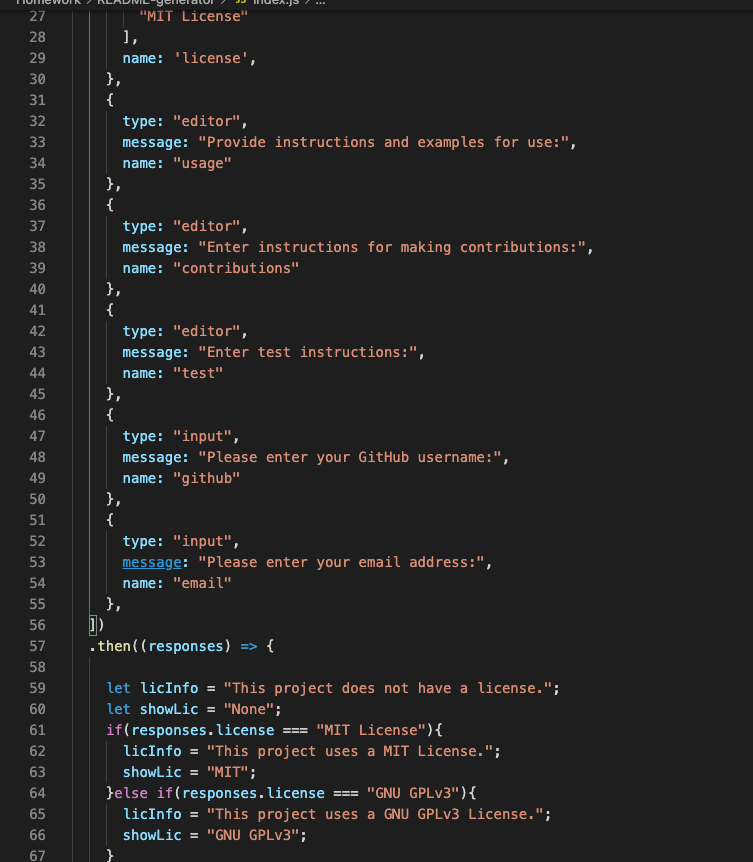

# README-generator
Through node.js using the command line to generate a README.md file.

## Links
Link to viedo: [README-Generator Video](https://drive.google.com/file/d/1Ta0nTjyvd2Z0R5I5POy5GeDHdoLAA6RE/view)

Link to sample README created using the application: [Sample README](https://drive.google.com/file/d/1EyPGkfjkoRJbPlIYKE78skfNDSnKFnNO/view?usp=sharing)

## Summary
Creating a README.md file through node.js using the inquirer package and command line prompts. A walkthrough video of how the application works and a sample readme generatred using the application can be found in the links above. 

## Table of Contents
1. [Usage](#usage)
2. [Set Up](#set-up)
3. [Resources](#resources)

## Usage
The README generator is launched through node.js the application is launched in the terminal. There the user type in "node index.js" which will trigger the inquirer prompts. The first prompt is an input that will ask for the title of the README. Once the user anwers a prompt the next will appear and so on until all are answered. Editor prompts were used for the deription,. install, usage, contribution, usage, and test propmts. This allows a text editor to open so long text is easier to write and also markdwon language is used so picutes, videos, and links can be added easily. 

 
 Once all the prompts are anwered a message saying "Successfully created README!" will appear and the README file will appear in visual studio code. Template literals were used to create the base structure of the README so once the prompts are answered the users answers will automatically be added into the file. 

 

 

Once the readme is created it can manuallly edited in vs code for small changes if the user doesn't want to have to go back through all the prompts. 

## Set Up
This application is run using the inquirer package so it must be installed. In the terminal type in "npm init -y" then "npm intall inquirer" to load the package to your local folder. A gitignore file was also created to store the .DS_Store folder and node_modules directory so that wouldn't be tracked or uploaded vto GitHub. 

An index.js file is also needed to write the code. the prompt function then sets up all the questions to guide the user in the terminal. The then promise is also used to get the answers and put them in the read me file. 

[]

## Resources
* [Contributer Covenant](https://www.contributor-covenant.org/version/2/0/code_of_conduct/code_of_conduct.txt)
* [Proffesional README Guide](https://coding-boot-camp.github.io/full-stack/github/professional-readme-guide)
* [npm Inquirer](https://www.npmjs.com/package/inquirer)
* [npm-init](https://docs.npmjs.com/cli/v7/commands/npm-init) 